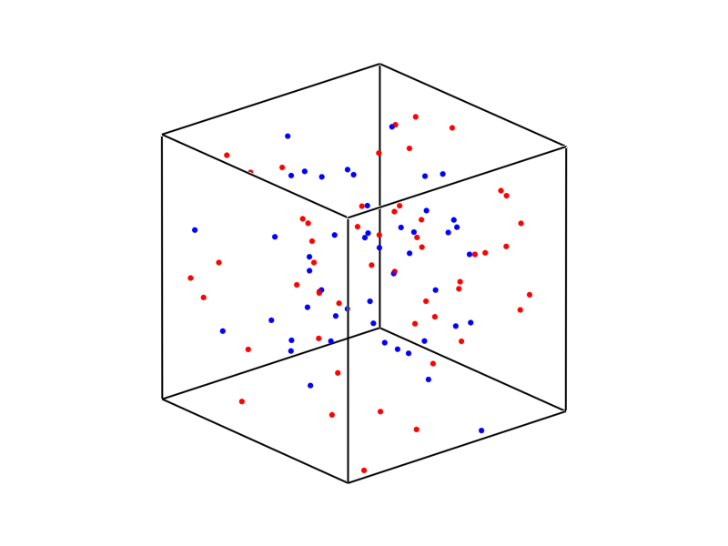

# PlotExTinyMD

[](https://github.com/ArrogantGao/PlotExTinyMD.jl/actions/workflows/CI.yml?query=branch%3Amain)
[](https://travis-ci.com/ArrogantGao/PlotExTinyMD.jl)
[](https://codecov.io/gh/ArrogantGao/PlotExTinyMD.jl)

`PlotExTinyMD` is a `Julia` package used to plot the result of `ExTinyMD.jl` using `GLMakie.jl`.

## Getting Started

Install the packaged by
```julia
pkg> add ExTinyMD, PlotExTinyMD
```

Two functions are provided
```julia
function video_trajection(trajectory, box)
```
is used to generate a video of the MD process, and
```julia
function figure_trajection(trajectory, box, step)
```
is used to generate a figure of result of step `step`.

## Example

The script `example/draw.jl` will run a simple MD process and plot the result, run the script by
```julia
julia draw.jl
```

Here is the figure result with `step = 100`

You can try to generate the video yourself.